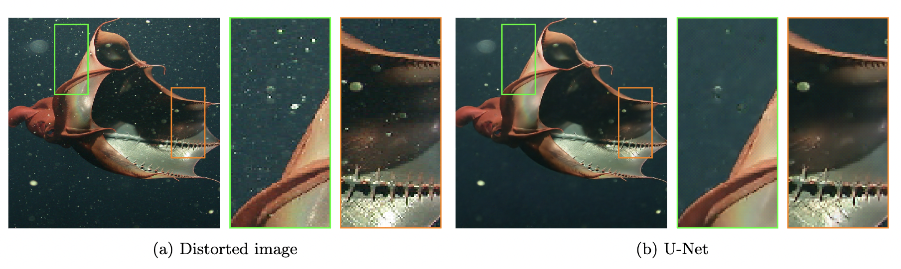

This is the official repository for the paper: "A deep learning approach for Marine Snow Synthesis and Removal" by Fernando Galetto and Guang Deng. 

## Datasets:

This paper introcudes 2 new datasets that can be downloaded from the following links:
- Marine snow samples: [link](www.google.com)
- Marine snow removal dataset: [link](www.google.com)

## Model

- GAN for Marine snow synthesis: [link](www.google.com)
- UNet for Marine snow removal: [link](www.google.com)

